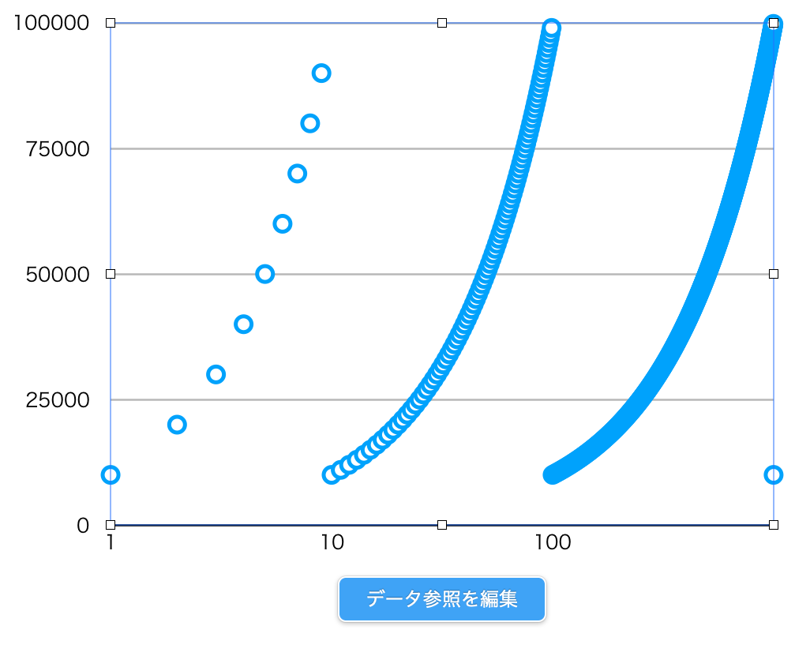

# 問題: ARC078 E - Awkward Response 

https://atcoder.jp/contests/arc078/tasks/arc078_c

隠された数 `N: 1 <= N <= 10^9` に対し、以下のクエリが64回まで実行できるので、`N`を特定せよ。

クエリ(Rubyで表現): `lambda{ |n| (n <= N && n.to_s <= N.to_s) || (n > N && n.to_s > N.to_s) }`

# メモ

以下、`Q(x,y) = (x <= y && x.to_s <= y.to_s) || (x > y && x.to_s > y.to_s)`とする(クエリは`Q(n,N)`)。

`n.to_s <= N.to_s`をなんとか数値にマップしたい。\
-> `f(n) = n * 10^(12 - [nの桁数]) + [nの桁数]`による数値順ソートは、少なくとも`1 <= n <= 10^10`の範囲で`n.to_s`による辞書順ソートと同じ結果を与える。

そこで、試しにいくつかの点`(n, f(n))`を２次元平面にプロットしてみるとこうなる(片対数軸):

ここまででわかることを整理してみる(`n,x,y,a,b`は全て正の整数)。

## `x != y` <=> `f(x) != f(y)`

従って`x <= y, f(x) <= f(y)`で等号が成り立つのは`x == y`の時のみ.

## `f(n)`は区間`[ 10^x, 10^(x+1) )`内では単調増加

よって`10^x <= a <= b < 10^(x+1)`ならば、`Q(a,b) == Q(b,a) == true`となる。\
つまり、`N`が区間`[ 10^x, 10^(x+1) )`にいることがわかったとして、この区間を直接二分探索して`N`を見つけることはできない。しかし、

## `10^x < n < 10^(x+1)`の時、`f(10n-1) < f(n) < f(10n)`

この性質により、「１つ大きい区間」から二分探索ができる\
(`f(N) < f(n)`を満たす最小の`n in [10^(x+1), 10^(x+2))`は`n/10 == N`を満たす)。

## `a = 10^x, b = 10^y`と書ける時、`Q(x,y) = Q(y,x) = true`.

つまり`N`が10のべき乗である時は上の二分探索は使えない。\
しかし、

